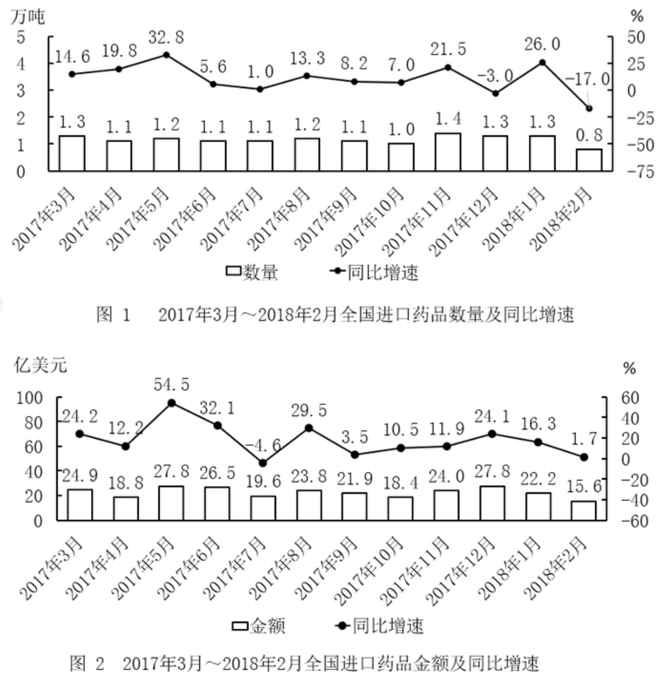
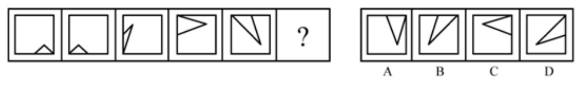
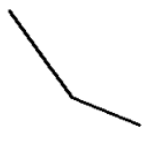

# 2019 国考地市级真题拆分核对样稿

这份样稿是题目拆分与新版真题库导入包的核对依据。对应的正式验证 ZIP 位于同级的“2019国考地市级真题验证包.zip”。

来源：用户提供的带答案版《2019年国家公务员录用考试〈行测〉题（地市级网友回忆版）(1).pdf》。答案以每题后面的“正确答案”标记为准。

## 模块标题与共用材料的区别

整套试卷的一至五模块大标题应作为独立模块信息提取，并让每道题关联所属模块。模块标题及其说明文字不属于题干，也不属于资料分析的共用材料。

第 25 页的“**五、资料分析**”及后面的作答说明仅作为模块五标题和模块说明保存。第 111-115 题真正共用的材料，是其后的两幅进口药品数据图表：图 1 为数量及同比增速，图 2 为金额及同比增速。试卷、五个模块、材料、题目、图片资源分别使用稳定 ID 与关联字段。

## 样例一：纯文字题

来源页：第 2 页，第 1 题；科目：常识判断。

**题干**：党的十八大以来，以习近平同志为核心的党中央，紧密结合新的时代条件和实践要求，以全新的视野深化对共产党执政规律、社会主义建设规律、人类社会发展规律的认识，创立了习近平新时代中国特色社会主义思想，其核心要义是：

**选项**

- A. 坚持和发展中国特色社会主义
- B. 中国特色社会主义进入了新时代
- C. 实现社会主义现代化和中华民族伟大复兴
- D. 坚持以人民为中心的发展思想

**正确答案**：A

**拆分规则**：题干、A-D 选项和答案均为文字字段，不创建图片资源。

## 样例二：图形推理

来源页：第 16 页，第 71 题；科目：判断推理。

**题干文字**：从所给的四个选项中，选择最合适的一个填入问号处，使之呈现一定的规律性：

**整张图形题图**：题干图形序列和四个图形选项作为同一张图片保存；不再拆成题干图和 A/B/C/D 四张选项图。

**选项字段**：A、B、C、D（作为独立文字选项标识，不保存四张选项图片）。

**正确答案**：B

## 样例三：资料分析共用材料与五道独立题干

共用材料：上方两幅图表，供第 111-115 题引用。每题仍分别保存自己的题干、选项和答案。

### 第111题（第25页）

题干：2017年第三季度，全国平均每吨进口药品单价约为多少万美元？

选项：A. 2；B. 19；C. 8；D. 96。正确答案：B。

### 第112题（第25页）

题干：2017年下半年，全国进口药品数量同比增速低于上月水平的月份有几个？

选项：A. 2；B. 3；C. 4；D. 5。正确答案：C。

### 第113题（第25页）

题干：2016年5月，全国进口药品金额环比增速：

选项：A. 超过100%；B. 在40%～100%之间；C. 在0%～40%之间；D. 低于0%。正确答案：C。

### 第114题（第26页，图片型选项）

题干：以下折线图中，能准确反映2017年第四季度各月全国进口药品金额环比增长率的是：

选项字母单独保存；图片只截取对应折线，不带题干文字或 A/B/C/D 字母。

| 选项 | 图片预览 |
| --- | --- |
| A |  |
| B |  |
| C |  |
| D |  |

正确答案：D。

### 第115题（第26页）

题干：能够从上述资料中推出的是：

选项：

- A. 2016年下半年，全国进口药品数量低于1万吨的月份仅有2个
- B. 2017年11月，全国平均每吨进口药品单价低于上年同期水平
- C. 2017年第二季度，全国进口药品金额超过75亿美元
- D. 2017年1月，全国进口药品金额超过20亿美元

正确答案：B。

## 当前提取规则

1. 模块一至五的大标题和模块说明单独提取；每题关联模块，模块文字不并入题干或材料。
2. 纯文字题：题干、选项、答案分别保存为文字字段。
3. 图形推理：题干说明保存为文字；图形序列和四个图形选项合成一张题图，不建立四张独立选项图片。
4. 资料分析：共用材料单独保存一次；第111-115题各自保留独立题干并关联同一材料。第114题的选项文字分别为A-D，四张图片只保留对应折线图本体。
5. 答案从 PDF 每题后的“正确答案”读取；题号需结合题目正文和版面位置识别，不能只靠行首数字切分。

新版导入验证包使用标准 Excel 工作表“试卷、模块、材料、题目、图片资源”，图片以 ZIP 根目录下的 `assets/` 文件保存，不写入 Base64。此首批包只导入已核对的 Q1、Q71、Q111-Q115 样题；其余模块仍作为试卷结构存在，不表示其他题目已经整理。
